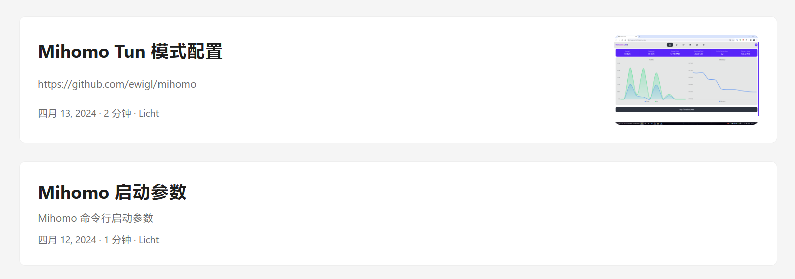
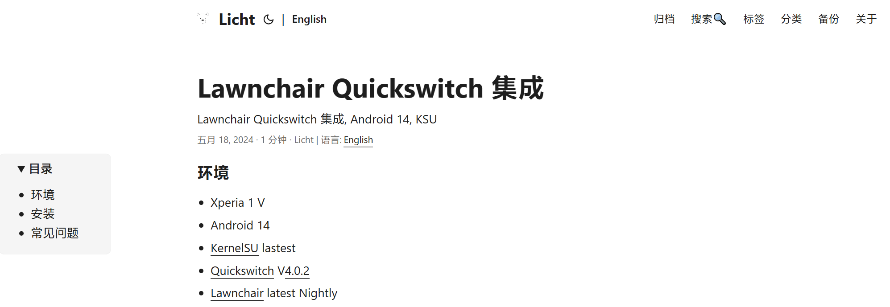

## Notes powered by Hugo.

[Hugo](https://github.com/gohugoio/hugo) 博客, [PaperMod](https://github.com/adityatelange/hugo-PaperMod) 主题, 部分自定义样式.

[https://ewigl.github.io/notes/](https://ewigl.github.io/notes/)

### 自定义样式 🎨

- [文章封面放在侧边, side-cover](./assets/css/extended/side-cover.css)
  

- [文章目录放在侧边, side-toc](./assets/css/extended/side-toc.css)
  
