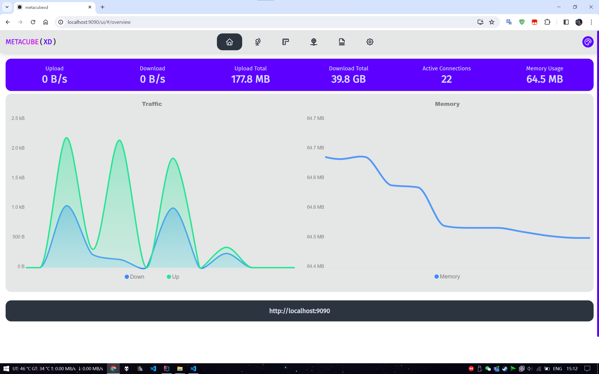

+++
title = 'Mihomo Tun Mode'
date = 2024-04-13
description = "https://github.com/ewigl/mihomo" 
author = "Licht"
tags = ["Mihomo", "Tun"]
categories = ["Apps", "Guide" ]
+++

## Why

- Tun mode can implement the true meaning of "Global Proxy", control all network traffic, including "CMD Box" and UWP applications.
- Set the startup on boot up to implement "No Sense" "Transparent Proxy", comfortable.
- The kernel has RESTFUL API, Web UI is enough, no need for GUI software (for me).
- Various GUI software on the task bar will leave a tray icon, less icon less un-beautiful, why not.
- PC local runs the kernel, it does not affect the family network of other devices (yes, I said I am using the router plugin), outside of work hours can have no sense proxy.

## Directory structure

- box_for_root - Box For Root (Magisk / KernelSU Module) required files
- custom-rules - Custom rules, according to personal needs to modify
- metacubexd - Web UI [Metacubexd](https://github.com/metacubex/metacubexd)
- proxies - Proxy server folder (store your server configuration locally)

  ···

- mihomo.startup.vbs - .VBS for silent start, hide the "black box"
- Mihomo StartUp.xml - Windows Task Scheduler backup file
- update-geo-files.bat - Update Geo data files script
- update-metacubexd.bat - Update Metacubexd script

## Windows configuration

1. Click <font color="#1f883d">Code</font> -> Download ZIP, unzip.
2. Modify `config.yaml`.

   - If you are using a subscription service, uncomment all `- Subscription` lines and fill your subscription link in the `Subscription` section under `proxy-providers`.

     `config.yaml`示例：

     ```yaml
     proxy-groups:
       # ...
       - name: 🇺🇸 America
         type: select
         use:
           # comment out all "- Local" in the `proxy-groups` section if you do not want to use local files
           # - Local
           - Subscription
         filter: "US|🇺🇸"
       # ...

     proxy-providers:
       # comment out "Local:" section in the `proxy-providers` section if you do not want to use local files
       # Local:
       #   type: file
       #   path: ./proxies/Local.yaml
       #   health-check:
       #     enable: true
       #     url: http://www.gstatic.com/generate_204
       #     interval: 7200

       Subscription:
         type: http
         # your subscription link here
         url: https://your.subscription.url
         path: ./proxies/Subscription.yaml
         health-check:
           enable: true
           url: http://www.gstatic.com/generate_204
           interval: 7200
     ```

   - If you use self-host servers or want to store server information locally, create a folder named `proxies`, create a file named `Local.yaml` in `proxies`.

     `Local.yaml`(Reference:[Mihomo Docs](https://wiki.metacubex.one/config/), or use any subscription converter.)

     ```yaml
     proxies:
       # shadowsocks
       - {
           name: 🇭🇰 HK,
           server: server.address.hk,
           port: 54321,
           type: ss,
           cipher: chacha20-ietf-poly1305,
           password: 123456789,
           udp: true,
         }
       # vmess
       - {
           name: 🇺🇸 US,
           server: 123.456.789.666,
           port: 443,
           type: vmess,
           uuid: 123456-7890-47c1-b1c3-6666666666666666,
           alterId: 0,
           cipher: auto,
           tls: true,
           skip-cert-verify: false,
           servername: rac.123456.xyz,
           network: ws,
           ws-opts: { path: /123456, headers: { Host: rac.123456.xyz } },
           udp: true,
         }
       # ...
     ```

3. Right click -> see properties, modify `mihomo-windows-amd64.exe`'s compatiable settings, tick "admin permission".
4. Double click `mihomo.startup.vbs` to run, allow admin permission.
5. Controller dashboard：[http://localhost:9090/ui](http://localhost:9090/ui). default secret: `998486`, can be changed in `config.yaml`.

### Windows start up task and skip account control window

1. Open Windows Task Scheduler.
2. Import `Mihomo StartUp.xml`, or NEW a task to run `mihomo.startup.vbs`.
3. Change task's name, file path, triger, condition...
4. **In "General/Common" tab, tick 'admin/higherst permission'.**

### Stop Mihomo

Run `mihomo.stop.bat`.

Or open Task Manager, terminate `mihomo-windows-amd64.exe`.

## Android configuration

### Box For Root usage:

0.  Flash [Box For Root](https://github.com/taamarin/box_for_magisk) using Magisk or KernelSU, no need to reboot immediately.
1.  Modify `config.yaml`. (Steps same as Windows configuration above)
2.  Copy files from `box_for_root` to `/data/adb/box`.
3.  Copy `custom-rules`, `metacubexd`, `proxies(optional)`, `GeoIP.dat`, `GeoSite.dat` to `/data/adb/box/calsh`.
4.  Modify `/data/adb/box` settings.ini, set `network_mode` to "tun".
5.  Reboot.
6.  Controller dashboard：[http://localhost:9090/ui](http://localhost:9090/ui). default secret: `998486`, can be changed in `config.yaml`.

## Preview



## References

[Mihomo](https://github.com/MetaCubeX/mihomo)

[Box For Root](https://github.com/taamarin/box_for_magisk)

[Mihomo Docs](https://wiki.metacubex.one/config/)

[Mihomo Params](https://ewigl.github.io/notes/en/posts/202404/mihomo-params/)
